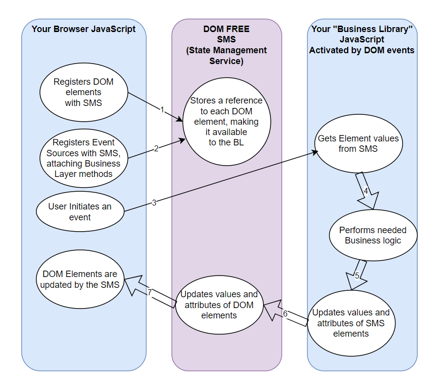
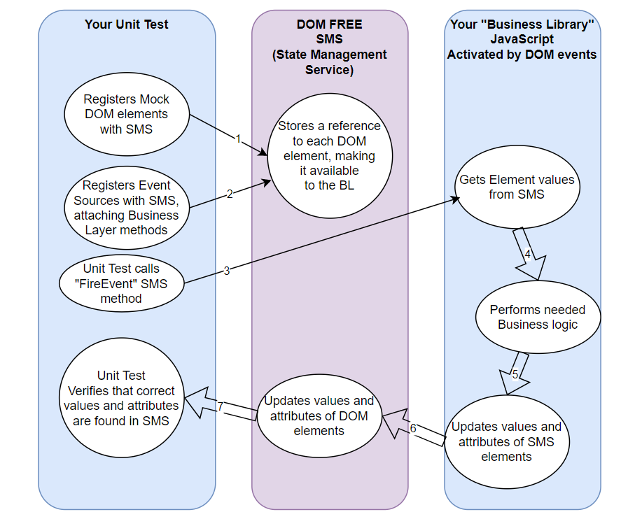

# Dom Free
# A state management system for JavaScript that will allow improved testability of client side code
## Why I built this system
I have been an agilista and evangelist for unit testing for many years.
However, along with others, I have considered JavaScript testing somewhat of a lost cause.
We have seen advancements in framework unit testing, but much of the JavaScript in the wild
remains untested, and largely untestable. This is principally because business logic is 
intermingled with DOM access code.

I thought if we could untangle that mess, we could make legitimately testable JavaScript code that operates upon the DOM indirectly. That is why I built this system.

## How it works
### Browser Code:


The JavaScript in your HTML file is simple, and is located in a single script tag as follows
```
<script lang="javascript">
	$(document).ready(() => {
		sms.Clear();
		sms.Register("firstName", $("#fname"))
            .attr('value', 'George');
		sms.Register("lastName", $("#lname"))
            .attr('value', 'Washington');

		sms.Register("moveFirstToLast", $("#moveFirstToLast"))
            .registerEvent("click", Library.MoveFirstToLast);

	})
</script>
```

When the use clicks the button with id = "moveFirstToLast," the library function Library.MoveFirstToLast is called by SMS. MoveFirstToLast looks like this:
`MoveFirstToLast: () => sms.Item('lastName').val(sms.Item('firstName').val()),`
You can see that we are using `sms.Item(<elementName>)` both to get the value (of firstName) and assign the value (to lastName).

## Unit Test Code:



The JavaScript in your Unit Test is very similar to the JavaScript in your HTML file (in fact, you can copy and paste). You just need to tell SMS that Mode is "Mock" as follows:

```
	beforeEach(function() {
		sms = SMS;
		sms.Clear();
		sms.Mode('Mock');
		lib = Library.default;
		
		firstName = sms.Register("firstName", "#fname")
            .attr('value', 'George');
		lastName = sms.Register("lastName", "#lname")
            .attr('value', 'Washington');

		sms.Register("moveFirstToLast", "#moveFirstToLast")
            .registerEvent("click", lib.MoveFirstToLast);

	})
```
Because `sms.Mode('Mock')` has been called, the second parameter to `sms.Register()` is ignored.

Then, in the unit test, we are able to verify the behavior of the MoveFirstToLast Library function, as follows:

```
it('should be able to Copy First Name to Last Name when clicked', function() {
		sms.Item('moveFirstToLast')
            .fireEvent('click');
		var target = sms.Item('lastName');
		expect(target.val())
            .toBe('George')
    });
```
This test passes, proving the the Library is able to modify the "DOM" as required.

Obviously, this is a test that does not prove very much, but in a realistic scenario, the result of a complicated Library function is indeed the changing of one or more DOM elements' values or attributes, which can be verified in unit tests.